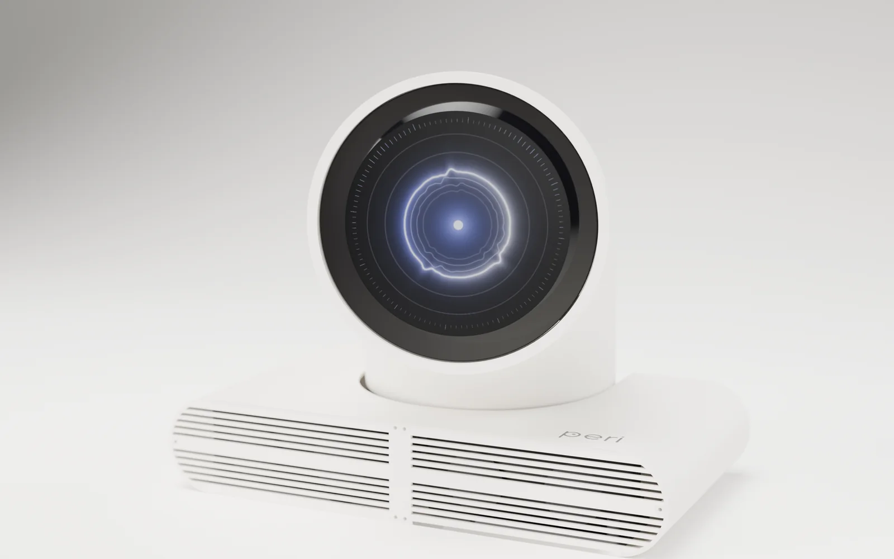
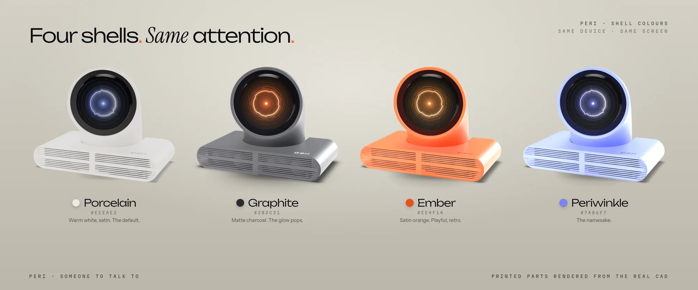
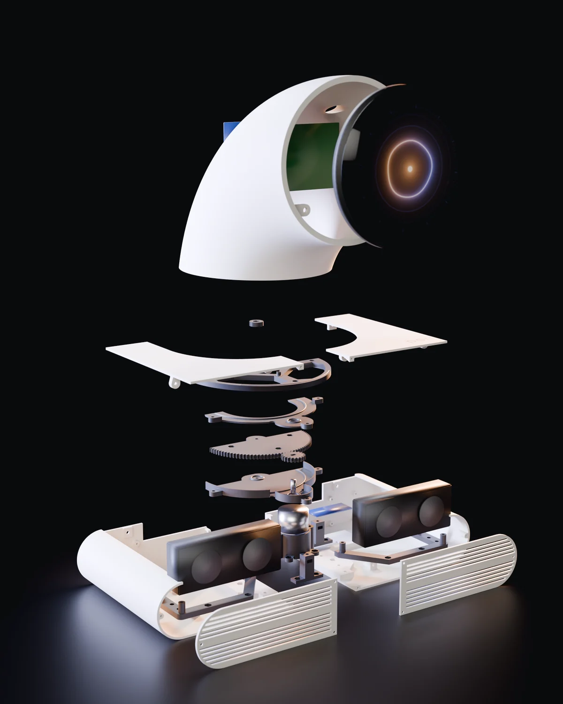

# Peri

*Someone to talk to.*

A 3D-printed voice chatbot built with a Raspberry Pi 4B, a round touch display, a WM8960 audio HAT and an Arduino Nano.

**[Parts](docs/PARTS.md) · [Print files](prints/README.md) · [Assembly](docs/ASSEMBLY.md) · [Setup](device/INSTALL.md) · [Using Peri](docs/USE.md)**

More renders — colour options and inside the case

### Choose your colour

Print the same case in your choice of filament. These renders show Porcelain, Graphite, Ember and Periwinkle.

### Inside Peri

An exploded render of the enclosure, neck mechanism, display and speakers. Use the [illustrated assembly guides](docs/ASSEMBLY.md) for the build sequence and wiring.

  

## Build one

Download this repository with **Code → Download ZIP**, then follow these steps:

1. **[Get the parts](docs/PARTS.md)** — electronics, speakers, screws and tools.
2. **[Print the case](prints/README.md)** — STL files, quantities and print notes. Use the Arduino variant for this build.
3. **[Assemble and wire it](docs/ASSEMBLY.md)** — follow the steps alongside the [main illustrated guide](docs/AssemblyGuide.pdf) and [Arduino mounting guide](docs/ArduinoAssemblyGuide.pdf).
4. **[Install the software](device/INSTALL.md)** — set up the Pi, add your own API key and flash the Nano.
5. **[Use Peri](docs/USE.md)** — touch controls, settings and troubleshooting.

The Pi software, speech and audio have been tested on the physical device with **Raspberry Pi OS (Legacy) 64-bit, released 2024-07-04**. **Head movement has not been verified:** the Arduino had no power during that test.

Conversation requires internet access and your own OpenAI API account. API usage is billed separately. Audio is sent to OpenAI while Peri is awake and its microphone is enabled.

## Files

| Folder | What you need it for |
|---|---|
| [prints/](prints/) | STL files and print quantities |
| [docs/](docs/) | Parts list, illustrated assembly guides and everyday use |
| [device/](device/) | Pi software, installer, display interface and Nano firmware |

Personal and noncommercial use is permitted under the [project licenses](LICENSE.md). Commercial use requires separate permission. Third-party fonts retain their [own licenses](THIRD_PARTY_NOTICES.md).
