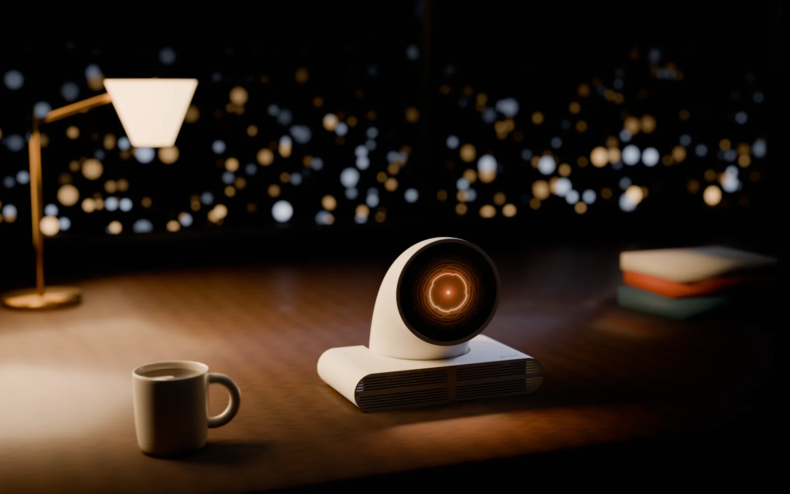

<h1 align="center">Peri</h1>

<em>Someone to talk to.</em>

  <a href="docs/PARTS.md">Parts</a> ·
  <a href="prints/README.md">Print files</a> ·
  <a href="docs/ASSEMBLY.md">Assembly</a> ·
  <a href="device/INSTALL.md">Setup</a> ·
  <a href="docs/USE.md">Using Peri</a>

Print it. Build it. Start a conversation.

## Make it yours

Print the same case in your choice of filament. These renders show Porcelain, Graphite, Ember and Periwinkle.

## From the inside out

An exploded render of the enclosure, neck mechanism, display and speakers. Use the [illustrated assembly guides](docs/ASSEMBLY.md) for the build sequence and wiring.

  

## A little company

Tap the display to wake Peri and start talking. Hold it to choose a voice, adjust the volume or change its personality.

*Product renders from the Peri website. Follow the assembly guides for the actual parts and wiring.*

## Build one

A 3D-printed voice chatbot built with a Raspberry Pi 4B, a round touch display and a WM8960 audio HAT with two speakers. The Arduino and motor are **optional**: the Arduino needs its own power source and does not connect to the Pi. There is no room for that USB connection inside the enclosure.

Download this repository with **Code → Download ZIP**, then follow these steps:

1. **[Get the parts](docs/PARTS.md)** — electronics, speakers, screws and tools.
2. **[Print the case](prints/README.md)** — choose the version without an Arduino, or the optional motorized version.
3. **[Assemble and wire it](docs/ASSEMBLY.md)** — follow the [main illustrated guide](docs/AssemblyGuide.pdf); use the [Arduino mounting guide](docs/ArduinoAssemblyGuide.pdf) only for the optional motor assembly.
4. **[Install the software](device/INSTALL.md)** — set up the Pi and add your own API key. No Arduino is required for conversation.
5. **[Use Peri](docs/USE.md)** — touch controls, settings and troubleshooting.

The Pi software, speech and audio have been tested on the physical device with **Raspberry Pi OS (Legacy) 64-bit, released 2024-07-04**. **Head movement has not been verified:** the Arduino had no power during that test.

Conversation requires internet access and your own OpenAI API account. API usage is billed separately. Audio is sent to OpenAI while Peri is awake and its microphone is enabled.

## Experimental

### Head movement

For builders who want a moving head, the [standalone sweep sketch](device/firmware/README.md) runs on the separately powered Arduino: **left → pause → middle → pause → right → pause → middle → pause**, repeating automatically. It starts with a small, estimated ±5° sweep. It is independent of speech and the Pi, and has **not been physically verified**. The guide covers wiring, uploading and checking clearance.

### Your own local AI

Want Peri to use the models and voices on your home server? **Local LLM, speech-to-text and text-to-speech support is not implemented yet**, but the code is here to adapt to your own setup with a coding agent. The [local AI guide](docs/LOCAL_AI.md) maps the integration points and includes a starter prompt for your agent. This takes code changes; it is not an existing settings toggle.

## Files

| Folder | What you need it for |
|---|---|
| [prints/](prints/) | STL files and print quantities |
| [docs/](docs/) | Parts list, illustrated assembly guides and everyday use |
| [device/](device/) | Pi software, installer, display interface and experimental motor firmware |

Personal and noncommercial use is permitted under the [project licenses](LICENSE.md). Commercial use requires separate permission. Third-party fonts retain their [own licenses](THIRD_PARTY_NOTICES.md).
